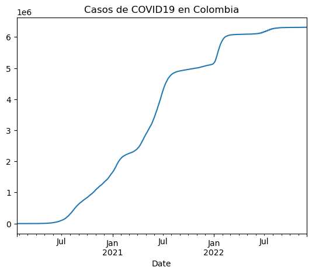
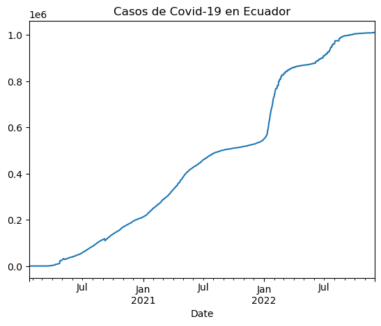
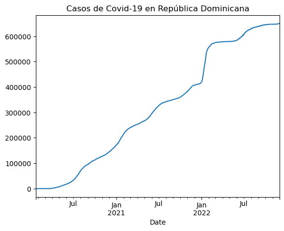
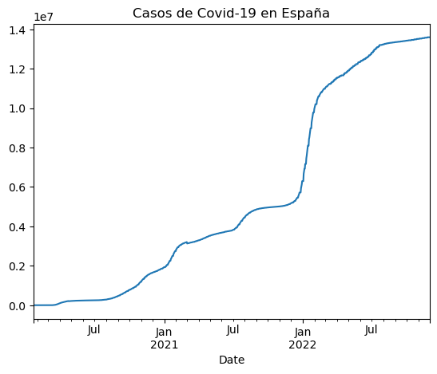

# **Uso de la Api del covid-19 con Pandas**

En esta práctica usaremos la Api Covid-19 con pandas, una librería de python que nos ayudará a leer y entender de una mejor forma la información de la Api. pero ¿Qué es un Api?  las Api son un conjunto de comandos, funciones y protocolos informáticos que permiten a los desarrolladores crear programas específicos para ciertos sistemas operativos, estas permiten simplificar en gran medida el trabajo de un creador de programas, ya que no tiene que «escribir» códigos desde cero. dicionalmente, permite usar funciones predefinidas para interactuar con el sistema operativo o con otro programa.

Para este caso usaremos la url : https://api.covid19api.com/countries

Iremos enumerando el paso a paso y describiendo para que sea más comprensible el desarrollo del ejercicio, así que sin mas...Vamos con el primer punto:

## 1. Instalacion de las librerías con la función !pip. Pip es un sistema de gestion de paquetes usados para gestionar "paquetes" de software escritos en Pyton


```python
!pip install pandas
```

    Requirement already satisfied: pandas in c:\users\angelica\anaconda3\lib\site-packages (1.4.4)
    Requirement already satisfied: python-dateutil>=2.8.1 in c:\users\angelica\anaconda3\lib\site-packages (from pandas) (2.8.2)
    Requirement already satisfied: numpy>=1.18.5 in c:\users\angelica\anaconda3\lib\site-packages (from pandas) (1.21.5)
    Requirement already satisfied: pytz>=2020.1 in c:\users\angelica\anaconda3\lib\site-packages (from pandas) (2022.1)
    Requirement already satisfied: six>=1.5 in c:\users\angelica\anaconda3\lib\site-packages (from python-dateutil>=2.8.1->pandas) (1.16.0)
    

## 2. Configuración de Pandas


```python
Para importar utilizaremos la convención "pd" como abreviatura para llamar a la librería.
```


```python
import pandas as pd
```

## 3. Creación de las variables. 

Las variables se crean con el signo "=" y se escriben intercomillados por ser una cadena de caracteres. Vamos a poner "miurl".


```python
miurl = "https://api.covid19api.com/countries"
```

Para saber cual es el valor de esta variable, en caso de querer conocerlo, tendremos que introducir el termino "miurl" y este tendrá que marcar un resultado igual a la url propuesta.


```python
miurl
```


    'https://api.covid19api.com/countries'


Si colocamos "miurl" dentro de un parentesis precedido por la funcion type(), mostrará que se trata de una cadena de caracteres.


```python
type(miurl)
```


    str


# Aquí inicia la magia de Pandas

## 4. Crear un dataframe

La abreviatura que se emplea para los dataframe es "df". Existe una función "read_json()" que lee el formato "json". Dentro del paréntesis indicaremos el valor de lo que queremos que lea, en este caso la url.


```python
df = pd.read_json(miurl)
```

Para lograr visualizar los datos llamamos al objeto. La tabla que nos aparecerá tendrá 3 columnas y una columna de control de pandas.


```python
df
```


<div>
<style scoped>
    .dataframe tbody tr th:only-of-type {
        vertical-align: middle;
    }

    .dataframe tbody tr th {
        vertical-align: top;
    }

    .dataframe thead th {
        text-align: right;
    }
</style>
<table border="1" class="dataframe">
  <thead>
    <tr style="text-align: right;">
      <th></th>
      <th>Country</th>
      <th>Slug</th>
      <th>ISO2</th>
    </tr>
  </thead>
  <tbody>
    <tr>
      <th>0</th>
      <td>Germany</td>
      <td>germany</td>
      <td>DE</td>
    </tr>
    <tr>
      <th>1</th>
      <td>Lebanon</td>
      <td>lebanon</td>
      <td>LB</td>
    </tr>
    <tr>
      <th>2</th>
      <td>Saint Lucia</td>
      <td>saint-lucia</td>
      <td>LC</td>
    </tr>
    <tr>
      <th>3</th>
      <td>Tunisia</td>
      <td>tunisia</td>
      <td>TN</td>
    </tr>
    <tr>
      <th>4</th>
      <td>Burkina Faso</td>
      <td>burkina-faso</td>
      <td>BF</td>
    </tr>
    <tr>
      <th>...</th>
      <td>...</td>
      <td>...</td>
      <td>...</td>
    </tr>
    <tr>
      <th>243</th>
      <td>United Kingdom</td>
      <td>united-kingdom</td>
      <td>GB</td>
    </tr>
    <tr>
      <th>244</th>
      <td>Cambodia</td>
      <td>cambodia</td>
      <td>KH</td>
    </tr>
    <tr>
      <th>245</th>
      <td>Poland</td>
      <td>poland</td>
      <td>PL</td>
    </tr>
    <tr>
      <th>246</th>
      <td>Algeria</td>
      <td>algeria</td>
      <td>DZ</td>
    </tr>
    <tr>
      <th>247</th>
      <td>Fiji</td>
      <td>fiji</td>
      <td>FJ</td>
    </tr>
  </tbody>
</table>
<p>248 rows × 3 columns</p>
</div>


## 5. Exploración de la tabla

Para ver las primeras entradas de la tabla, tendrémos que utilizar las siguientes funciones. Estas nos darán los seis primeros países en la tabla según su posición.


```python
df.head(6)
```


<div>
<style scoped>
    .dataframe tbody tr th:only-of-type {
        vertical-align: middle;
    }

    .dataframe tbody tr th {
        vertical-align: top;
    }

    .dataframe thead th {
        text-align: right;
    }
</style>
<table border="1" class="dataframe">
  <thead>
    <tr style="text-align: right;">
      <th></th>
      <th>Country</th>
      <th>Slug</th>
      <th>ISO2</th>
    </tr>
  </thead>
  <tbody>
    <tr>
      <th>0</th>
      <td>Germany</td>
      <td>germany</td>
      <td>DE</td>
    </tr>
    <tr>
      <th>1</th>
      <td>Lebanon</td>
      <td>lebanon</td>
      <td>LB</td>
    </tr>
    <tr>
      <th>2</th>
      <td>Saint Lucia</td>
      <td>saint-lucia</td>
      <td>LC</td>
    </tr>
    <tr>
      <th>3</th>
      <td>Tunisia</td>
      <td>tunisia</td>
      <td>TN</td>
    </tr>
    <tr>
      <th>4</th>
      <td>Burkina Faso</td>
      <td>burkina-faso</td>
      <td>BF</td>
    </tr>
    <tr>
      <th>5</th>
      <td>Italy</td>
      <td>italy</td>
      <td>IT</td>
    </tr>
  </tbody>
</table>
</div>


```python
La siguiente nos permitirá ver las seis últimas.
```


```python
df.tail(6)
```


<div>
<style scoped>
    .dataframe tbody tr th:only-of-type {
        vertical-align: middle;
    }

    .dataframe tbody tr th {
        vertical-align: top;
    }

    .dataframe thead th {
        text-align: right;
    }
</style>
<table border="1" class="dataframe">
  <thead>
    <tr style="text-align: right;">
      <th></th>
      <th>Country</th>
      <th>Slug</th>
      <th>ISO2</th>
    </tr>
  </thead>
  <tbody>
    <tr>
      <th>242</th>
      <td>Sri Lanka</td>
      <td>sri-lanka</td>
      <td>LK</td>
    </tr>
    <tr>
      <th>243</th>
      <td>United Kingdom</td>
      <td>united-kingdom</td>
      <td>GB</td>
    </tr>
    <tr>
      <th>244</th>
      <td>Cambodia</td>
      <td>cambodia</td>
      <td>KH</td>
    </tr>
    <tr>
      <th>245</th>
      <td>Poland</td>
      <td>poland</td>
      <td>PL</td>
    </tr>
    <tr>
      <th>246</th>
      <td>Algeria</td>
      <td>algeria</td>
      <td>DZ</td>
    </tr>
    <tr>
      <th>247</th>
      <td>Fiji</td>
      <td>fiji</td>
      <td>FJ</td>
    </tr>
  </tbody>
</table>
</div>


Si se quiere conocer más información sobre las variables que contiene el dataframe es necesario utilizar la siguiente función:


```python
df.info()
```

    <class 'pandas.core.frame.DataFrame'>
    RangeIndex: 248 entries, 0 to 247
    Data columns (total 3 columns):
     #   Column   Non-Null Count  Dtype 
    ---  ------   --------------  ----- 
     0   Country  248 non-null    object
     1   Slug     248 non-null    object
     2   ISO2     248 non-null    object
    dtypes: object(3)
    memory usage: 5.9+ KB
    

Para lograr ver una sola variable de la lista, se utiliza la siguiente función: 


```python
df['Country']
```


    0             Germany
    1             Lebanon
    2         Saint Lucia
    3             Tunisia
    4        Burkina Faso
                ...      
    243    United Kingdom
    244          Cambodia
    245            Poland
    246           Algeria
    247              Fiji
    Name: Country, Length: 248, dtype: object


Para ver un valor concreto de una de las variables se utiliza la siguiente función:


```python
df['Country'][66]
```


    'Tonga'


## 6.Tiempos reales

La url que utilizaremos para la siguiente parte del ejercicio será la api del COVID19 de acceso libre: https://api.covid19api.com/country/colombia/status/confirmed/live

Se guardará la información de la misma forma como lo hicimos antes pero agregando la abreviatura de Colombia "df_co". Esta cambiará según la información que necesite. 


```python
url_co = 'https://api.covid19api.com/country/colombia/status/confirmed/live'
df_co = pd.read_json(url_co)
df_co
```


<div>
<style scoped>
    .dataframe tbody tr th:only-of-type {
        vertical-align: middle;
    }

    .dataframe tbody tr th {
        vertical-align: top;
    }

    .dataframe thead th {
        text-align: right;
    }
</style>
<table border="1" class="dataframe">
  <thead>
    <tr style="text-align: right;">
      <th></th>
      <th>Country</th>
      <th>CountryCode</th>
      <th>Province</th>
      <th>City</th>
      <th>CityCode</th>
      <th>Lat</th>
      <th>Lon</th>
      <th>Cases</th>
      <th>Status</th>
      <th>Date</th>
    </tr>
  </thead>
  <tbody>
    <tr>
      <th>0</th>
      <td>Colombia</td>
      <td>CO</td>
      <td></td>
      <td></td>
      <td></td>
      <td>4.57</td>
      <td>-74.3</td>
      <td>0</td>
      <td>confirmed</td>
      <td>2020-01-22 00:00:00+00:00</td>
    </tr>
    <tr>
      <th>1</th>
      <td>Colombia</td>
      <td>CO</td>
      <td></td>
      <td></td>
      <td></td>
      <td>4.57</td>
      <td>-74.3</td>
      <td>0</td>
      <td>confirmed</td>
      <td>2020-01-23 00:00:00+00:00</td>
    </tr>
    <tr>
      <th>2</th>
      <td>Colombia</td>
      <td>CO</td>
      <td></td>
      <td></td>
      <td></td>
      <td>4.57</td>
      <td>-74.3</td>
      <td>0</td>
      <td>confirmed</td>
      <td>2020-01-24 00:00:00+00:00</td>
    </tr>
    <tr>
      <th>3</th>
      <td>Colombia</td>
      <td>CO</td>
      <td></td>
      <td></td>
      <td></td>
      <td>4.57</td>
      <td>-74.3</td>
      <td>0</td>
      <td>confirmed</td>
      <td>2020-01-25 00:00:00+00:00</td>
    </tr>
    <tr>
      <th>4</th>
      <td>Colombia</td>
      <td>CO</td>
      <td></td>
      <td></td>
      <td></td>
      <td>4.57</td>
      <td>-74.3</td>
      <td>0</td>
      <td>confirmed</td>
      <td>2020-01-26 00:00:00+00:00</td>
    </tr>
    <tr>
      <th>...</th>
      <td>...</td>
      <td>...</td>
      <td>...</td>
      <td>...</td>
      <td>...</td>
      <td>...</td>
      <td>...</td>
      <td>...</td>
      <td>...</td>
      <td>...</td>
    </tr>
    <tr>
      <th>1039</th>
      <td>Colombia</td>
      <td>CO</td>
      <td></td>
      <td></td>
      <td></td>
      <td>4.57</td>
      <td>-74.3</td>
      <td>6312657</td>
      <td>confirmed</td>
      <td>2022-11-26 00:00:00+00:00</td>
    </tr>
    <tr>
      <th>1040</th>
      <td>Colombia</td>
      <td>CO</td>
      <td></td>
      <td></td>
      <td></td>
      <td>4.57</td>
      <td>-74.3</td>
      <td>6312657</td>
      <td>confirmed</td>
      <td>2022-11-27 00:00:00+00:00</td>
    </tr>
    <tr>
      <th>1041</th>
      <td>Colombia</td>
      <td>CO</td>
      <td></td>
      <td></td>
      <td></td>
      <td>4.57</td>
      <td>-74.3</td>
      <td>6312657</td>
      <td>confirmed</td>
      <td>2022-11-28 00:00:00+00:00</td>
    </tr>
    <tr>
      <th>1042</th>
      <td>Colombia</td>
      <td>CO</td>
      <td></td>
      <td></td>
      <td></td>
      <td>4.57</td>
      <td>-74.3</td>
      <td>6312657</td>
      <td>confirmed</td>
      <td>2022-11-29 00:00:00+00:00</td>
    </tr>
    <tr>
      <th>1043</th>
      <td>Colombia</td>
      <td>CO</td>
      <td></td>
      <td></td>
      <td></td>
      <td>4.57</td>
      <td>-74.3</td>
      <td>6312657</td>
      <td>confirmed</td>
      <td>2022-11-30 00:00:00+00:00</td>
    </tr>
  </tbody>
</table>
<p>1044 rows × 10 columns</p>
</div>


## 7.Exploración de datos

Llamamos a todos los datos de las columnas:


```python
df_co.columns
```


    Index(['Country', 'CountryCode', 'Province', 'City', 'CityCode', 'Lat', 'Lon',
           'Cases', 'Status', 'Date'],
          dtype='object')


Llamamos los datos de la cabecera:


```python
df_co.head(2)
```


<div>
<style scoped>
    .dataframe tbody tr th:only-of-type {
        vertical-align: middle;
    }

    .dataframe tbody tr th {
        vertical-align: top;
    }

    .dataframe thead th {
        text-align: right;
    }
</style>
<table border="1" class="dataframe">
  <thead>
    <tr style="text-align: right;">
      <th></th>
      <th>Country</th>
      <th>CountryCode</th>
      <th>Province</th>
      <th>City</th>
      <th>CityCode</th>
      <th>Lat</th>
      <th>Lon</th>
      <th>Cases</th>
      <th>Status</th>
      <th>Date</th>
    </tr>
  </thead>
  <tbody>
    <tr>
      <th>0</th>
      <td>Colombia</td>
      <td>CO</td>
      <td></td>
      <td></td>
      <td></td>
      <td>4.57</td>
      <td>-74.3</td>
      <td>0</td>
      <td>confirmed</td>
      <td>2020-01-22 00:00:00+00:00</td>
    </tr>
    <tr>
      <th>1</th>
      <td>Colombia</td>
      <td>CO</td>
      <td></td>
      <td></td>
      <td></td>
      <td>4.57</td>
      <td>-74.3</td>
      <td>0</td>
      <td>confirmed</td>
      <td>2020-01-23 00:00:00+00:00</td>
    </tr>
  </tbody>
</table>
</div>


También llamamos últimos datos, esta información nos permitirá ver si los datos han variado.


```python
df_co.tail(20)
```


<div>
<style scoped>
    .dataframe tbody tr th:only-of-type {
        vertical-align: middle;
    }

    .dataframe tbody tr th {
        vertical-align: top;
    }

    .dataframe thead th {
        text-align: right;
    }
</style>
<table border="1" class="dataframe">
  <thead>
    <tr style="text-align: right;">
      <th></th>
      <th>Country</th>
      <th>CountryCode</th>
      <th>Province</th>
      <th>City</th>
      <th>CityCode</th>
      <th>Lat</th>
      <th>Lon</th>
      <th>Cases</th>
      <th>Status</th>
      <th>Date</th>
    </tr>
  </thead>
  <tbody>
    <tr>
      <th>1024</th>
      <td>Colombia</td>
      <td>CO</td>
      <td></td>
      <td></td>
      <td></td>
      <td>4.57</td>
      <td>-74.3</td>
      <td>6311359</td>
      <td>confirmed</td>
      <td>2022-11-11 00:00:00+00:00</td>
    </tr>
    <tr>
      <th>1025</th>
      <td>Colombia</td>
      <td>CO</td>
      <td></td>
      <td></td>
      <td></td>
      <td>4.57</td>
      <td>-74.3</td>
      <td>6311359</td>
      <td>confirmed</td>
      <td>2022-11-12 00:00:00+00:00</td>
    </tr>
    <tr>
      <th>1026</th>
      <td>Colombia</td>
      <td>CO</td>
      <td></td>
      <td></td>
      <td></td>
      <td>4.57</td>
      <td>-74.3</td>
      <td>6311359</td>
      <td>confirmed</td>
      <td>2022-11-13 00:00:00+00:00</td>
    </tr>
    <tr>
      <th>1027</th>
      <td>Colombia</td>
      <td>CO</td>
      <td></td>
      <td></td>
      <td></td>
      <td>4.57</td>
      <td>-74.3</td>
      <td>6311359</td>
      <td>confirmed</td>
      <td>2022-11-14 00:00:00+00:00</td>
    </tr>
    <tr>
      <th>1028</th>
      <td>Colombia</td>
      <td>CO</td>
      <td></td>
      <td></td>
      <td></td>
      <td>4.57</td>
      <td>-74.3</td>
      <td>6311359</td>
      <td>confirmed</td>
      <td>2022-11-15 00:00:00+00:00</td>
    </tr>
    <tr>
      <th>1029</th>
      <td>Colombia</td>
      <td>CO</td>
      <td></td>
      <td></td>
      <td></td>
      <td>4.57</td>
      <td>-74.3</td>
      <td>6311359</td>
      <td>confirmed</td>
      <td>2022-11-16 00:00:00+00:00</td>
    </tr>
    <tr>
      <th>1030</th>
      <td>Colombia</td>
      <td>CO</td>
      <td></td>
      <td></td>
      <td></td>
      <td>4.57</td>
      <td>-74.3</td>
      <td>6312657</td>
      <td>confirmed</td>
      <td>2022-11-17 00:00:00+00:00</td>
    </tr>
    <tr>
      <th>1031</th>
      <td>Colombia</td>
      <td>CO</td>
      <td></td>
      <td></td>
      <td></td>
      <td>4.57</td>
      <td>-74.3</td>
      <td>6312657</td>
      <td>confirmed</td>
      <td>2022-11-18 00:00:00+00:00</td>
    </tr>
    <tr>
      <th>1032</th>
      <td>Colombia</td>
      <td>CO</td>
      <td></td>
      <td></td>
      <td></td>
      <td>4.57</td>
      <td>-74.3</td>
      <td>6312657</td>
      <td>confirmed</td>
      <td>2022-11-19 00:00:00+00:00</td>
    </tr>
    <tr>
      <th>1033</th>
      <td>Colombia</td>
      <td>CO</td>
      <td></td>
      <td></td>
      <td></td>
      <td>4.57</td>
      <td>-74.3</td>
      <td>6312657</td>
      <td>confirmed</td>
      <td>2022-11-20 00:00:00+00:00</td>
    </tr>
    <tr>
      <th>1034</th>
      <td>Colombia</td>
      <td>CO</td>
      <td></td>
      <td></td>
      <td></td>
      <td>4.57</td>
      <td>-74.3</td>
      <td>6312657</td>
      <td>confirmed</td>
      <td>2022-11-21 00:00:00+00:00</td>
    </tr>
    <tr>
      <th>1035</th>
      <td>Colombia</td>
      <td>CO</td>
      <td></td>
      <td></td>
      <td></td>
      <td>4.57</td>
      <td>-74.3</td>
      <td>6312657</td>
      <td>confirmed</td>
      <td>2022-11-22 00:00:00+00:00</td>
    </tr>
    <tr>
      <th>1036</th>
      <td>Colombia</td>
      <td>CO</td>
      <td></td>
      <td></td>
      <td></td>
      <td>4.57</td>
      <td>-74.3</td>
      <td>6312657</td>
      <td>confirmed</td>
      <td>2022-11-23 00:00:00+00:00</td>
    </tr>
    <tr>
      <th>1037</th>
      <td>Colombia</td>
      <td>CO</td>
      <td></td>
      <td></td>
      <td></td>
      <td>4.57</td>
      <td>-74.3</td>
      <td>6312657</td>
      <td>confirmed</td>
      <td>2022-11-24 00:00:00+00:00</td>
    </tr>
    <tr>
      <th>1038</th>
      <td>Colombia</td>
      <td>CO</td>
      <td></td>
      <td></td>
      <td></td>
      <td>4.57</td>
      <td>-74.3</td>
      <td>6312657</td>
      <td>confirmed</td>
      <td>2022-11-25 00:00:00+00:00</td>
    </tr>
    <tr>
      <th>1039</th>
      <td>Colombia</td>
      <td>CO</td>
      <td></td>
      <td></td>
      <td></td>
      <td>4.57</td>
      <td>-74.3</td>
      <td>6312657</td>
      <td>confirmed</td>
      <td>2022-11-26 00:00:00+00:00</td>
    </tr>
    <tr>
      <th>1040</th>
      <td>Colombia</td>
      <td>CO</td>
      <td></td>
      <td></td>
      <td></td>
      <td>4.57</td>
      <td>-74.3</td>
      <td>6312657</td>
      <td>confirmed</td>
      <td>2022-11-27 00:00:00+00:00</td>
    </tr>
    <tr>
      <th>1041</th>
      <td>Colombia</td>
      <td>CO</td>
      <td></td>
      <td></td>
      <td></td>
      <td>4.57</td>
      <td>-74.3</td>
      <td>6312657</td>
      <td>confirmed</td>
      <td>2022-11-28 00:00:00+00:00</td>
    </tr>
    <tr>
      <th>1042</th>
      <td>Colombia</td>
      <td>CO</td>
      <td></td>
      <td></td>
      <td></td>
      <td>4.57</td>
      <td>-74.3</td>
      <td>6312657</td>
      <td>confirmed</td>
      <td>2022-11-29 00:00:00+00:00</td>
    </tr>
    <tr>
      <th>1043</th>
      <td>Colombia</td>
      <td>CO</td>
      <td></td>
      <td></td>
      <td></td>
      <td>4.57</td>
      <td>-74.3</td>
      <td>6312657</td>
      <td>confirmed</td>
      <td>2022-11-30 00:00:00+00:00</td>
    </tr>
  </tbody>
</table>
</div>


Ahora llamamos la información de las variables para prever posibles errores:


```python
df_co.info()
```

    <class 'pandas.core.frame.DataFrame'>
    RangeIndex: 1044 entries, 0 to 1043
    Data columns (total 10 columns):
     #   Column       Non-Null Count  Dtype              
    ---  ------       --------------  -----              
     0   Country      1044 non-null   object             
     1   CountryCode  1044 non-null   object             
     2   Province     1044 non-null   object             
     3   City         1044 non-null   object             
     4   CityCode     1044 non-null   object             
     5   Lat          1044 non-null   float64            
     6   Lon          1044 non-null   float64            
     7   Cases        1044 non-null   int64              
     8   Status       1044 non-null   object             
     9   Date         1044 non-null   datetime64[ns, UTC]
    dtypes: datetime64[ns, UTC](1), float64(2), int64(1), object(6)
    memory usage: 81.7+ KB
    


```python
Para lograr una descripción estadística de las variables numéricas de la trama de datos usamos la función "describir". 
Este código es útil cuando usamos muchos datos numéricos.
```


```python
df_co.describe()
```


<div>
<style scoped>
    .dataframe tbody tr th:only-of-type {
        vertical-align: middle;
    }

    .dataframe tbody tr th {
        vertical-align: top;
    }

    .dataframe thead th {
        text-align: right;
    }
</style>
<table border="1" class="dataframe">
  <thead>
    <tr style="text-align: right;">
      <th></th>
      <th>Lat</th>
      <th>Lon</th>
      <th>Cases</th>
    </tr>
  </thead>
  <tbody>
    <tr>
      <th>count</th>
      <td>1.044000e+03</td>
      <td>1.044000e+03</td>
      <td>1.044000e+03</td>
    </tr>
    <tr>
      <th>mean</th>
      <td>4.570000e+00</td>
      <td>-7.430000e+01</td>
      <td>3.435768e+06</td>
    </tr>
    <tr>
      <th>std</th>
      <td>1.954929e-14</td>
      <td>1.464420e-12</td>
      <td>2.437449e+06</td>
    </tr>
    <tr>
      <th>min</th>
      <td>4.570000e+00</td>
      <td>-7.430000e+01</td>
      <td>0.000000e+00</td>
    </tr>
    <tr>
      <th>25%</th>
      <td>4.570000e+00</td>
      <td>-7.430000e+01</td>
      <td>8.922698e+05</td>
    </tr>
    <tr>
      <th>50%</th>
      <td>4.570000e+00</td>
      <td>-7.430000e+01</td>
      <td>4.142528e+06</td>
    </tr>
    <tr>
      <th>75%</th>
      <td>4.570000e+00</td>
      <td>-7.430000e+01</td>
      <td>6.077431e+06</td>
    </tr>
    <tr>
      <th>max</th>
      <td>4.570000e+00</td>
      <td>-7.430000e+01</td>
      <td>6.312657e+06</td>
    </tr>
  </tbody>
</table>
</div>


## 8. Elaboración de gráficos

Pandas también nos permite hacer gráficos, para ello seleccionamos las columnas que nos sirven para elaborarlo con datos de la tabla y luego establecemos los ejes X y Y para nuestro gráfico. la columna de control será el "date".


```python
df_co.set_index('Date')
```


<div>
<style scoped>
    .dataframe tbody tr th:only-of-type {
        vertical-align: middle;
    }

    .dataframe tbody tr th {
        vertical-align: top;
    }

    .dataframe thead th {
        text-align: right;
    }
</style>
<table border="1" class="dataframe">
  <thead>
    <tr style="text-align: right;">
      <th></th>
      <th>Country</th>
      <th>CountryCode</th>
      <th>Province</th>
      <th>City</th>
      <th>CityCode</th>
      <th>Lat</th>
      <th>Lon</th>
      <th>Cases</th>
      <th>Status</th>
    </tr>
    <tr>
      <th>Date</th>
      <th></th>
      <th></th>
      <th></th>
      <th></th>
      <th></th>
      <th></th>
      <th></th>
      <th></th>
      <th></th>
    </tr>
  </thead>
  <tbody>
    <tr>
      <th>2020-01-22 00:00:00+00:00</th>
      <td>Colombia</td>
      <td>CO</td>
      <td></td>
      <td></td>
      <td></td>
      <td>4.57</td>
      <td>-74.3</td>
      <td>0</td>
      <td>confirmed</td>
    </tr>
    <tr>
      <th>2020-01-23 00:00:00+00:00</th>
      <td>Colombia</td>
      <td>CO</td>
      <td></td>
      <td></td>
      <td></td>
      <td>4.57</td>
      <td>-74.3</td>
      <td>0</td>
      <td>confirmed</td>
    </tr>
    <tr>
      <th>2020-01-24 00:00:00+00:00</th>
      <td>Colombia</td>
      <td>CO</td>
      <td></td>
      <td></td>
      <td></td>
      <td>4.57</td>
      <td>-74.3</td>
      <td>0</td>
      <td>confirmed</td>
    </tr>
    <tr>
      <th>2020-01-25 00:00:00+00:00</th>
      <td>Colombia</td>
      <td>CO</td>
      <td></td>
      <td></td>
      <td></td>
      <td>4.57</td>
      <td>-74.3</td>
      <td>0</td>
      <td>confirmed</td>
    </tr>
    <tr>
      <th>2020-01-26 00:00:00+00:00</th>
      <td>Colombia</td>
      <td>CO</td>
      <td></td>
      <td></td>
      <td></td>
      <td>4.57</td>
      <td>-74.3</td>
      <td>0</td>
      <td>confirmed</td>
    </tr>
    <tr>
      <th>...</th>
      <td>...</td>
      <td>...</td>
      <td>...</td>
      <td>...</td>
      <td>...</td>
      <td>...</td>
      <td>...</td>
      <td>...</td>
      <td>...</td>
    </tr>
    <tr>
      <th>2022-11-26 00:00:00+00:00</th>
      <td>Colombia</td>
      <td>CO</td>
      <td></td>
      <td></td>
      <td></td>
      <td>4.57</td>
      <td>-74.3</td>
      <td>6312657</td>
      <td>confirmed</td>
    </tr>
    <tr>
      <th>2022-11-27 00:00:00+00:00</th>
      <td>Colombia</td>
      <td>CO</td>
      <td></td>
      <td></td>
      <td></td>
      <td>4.57</td>
      <td>-74.3</td>
      <td>6312657</td>
      <td>confirmed</td>
    </tr>
    <tr>
      <th>2022-11-28 00:00:00+00:00</th>
      <td>Colombia</td>
      <td>CO</td>
      <td></td>
      <td></td>
      <td></td>
      <td>4.57</td>
      <td>-74.3</td>
      <td>6312657</td>
      <td>confirmed</td>
    </tr>
    <tr>
      <th>2022-11-29 00:00:00+00:00</th>
      <td>Colombia</td>
      <td>CO</td>
      <td></td>
      <td></td>
      <td></td>
      <td>4.57</td>
      <td>-74.3</td>
      <td>6312657</td>
      <td>confirmed</td>
    </tr>
    <tr>
      <th>2022-11-30 00:00:00+00:00</th>
      <td>Colombia</td>
      <td>CO</td>
      <td></td>
      <td></td>
      <td></td>
      <td>4.57</td>
      <td>-74.3</td>
      <td>6312657</td>
      <td>confirmed</td>
    </tr>
  </tbody>
</table>
<p>1044 rows × 9 columns</p>
</div>


Dado que necesitamos que la tabla también entregue los datos confirmados usamos el siguiente comando:


```python
df_co.set_index('Date')['Cases']
```


    Date
    2020-01-22 00:00:00+00:00          0
    2020-01-23 00:00:00+00:00          0
    2020-01-24 00:00:00+00:00          0
    2020-01-25 00:00:00+00:00          0
    2020-01-26 00:00:00+00:00          0
                                  ...   
    2022-11-26 00:00:00+00:00    6312657
    2022-11-27 00:00:00+00:00    6312657
    2022-11-28 00:00:00+00:00    6312657
    2022-11-29 00:00:00+00:00    6312657
    2022-11-30 00:00:00+00:00    6312657
    Name: Cases, Length: 1044, dtype: int64


Ya con estos datos, ahora sí hacemos el gráfico con la función "plot" que significa "plotear" o hacer el gráfico.


```python
df_co.set_index('Date')['Cases'].plot()
```


    <AxesSubplot:xlabel='Date'>


    

    


le pondremos nombre al gráfico con la función "título".


```python
df_co.set_index('Date')['Cases'].plot(title= "Casos de COVID19 en Colombia")
```


    <AxesSubplot:title={'center':'Casos de COVID19 en Colombia'}, xlabel='Date'>


    

    


### y, Para completar esta actividad repetiremos los mismos pasos para Ecuador, República Dominicana y España. Iniciamos con Ecuador

nuevamente traemos y nombramos los datos


```python
url_ecu = 'https://api.covid19api.com/country/Ecuador/status/confirmed/live'
df_ecu = pd.read_json (url_ecu)
df_ecu
```


<div>
<style scoped>
    .dataframe tbody tr th:only-of-type {
        vertical-align: middle;
    }

    .dataframe tbody tr th {
        vertical-align: top;
    }

    .dataframe thead th {
        text-align: right;
    }
</style>
<table border="1" class="dataframe">
  <thead>
    <tr style="text-align: right;">
      <th></th>
      <th>Country</th>
      <th>CountryCode</th>
      <th>Province</th>
      <th>City</th>
      <th>CityCode</th>
      <th>Lat</th>
      <th>Lon</th>
      <th>Cases</th>
      <th>Status</th>
      <th>Date</th>
    </tr>
  </thead>
  <tbody>
    <tr>
      <th>0</th>
      <td>Ecuador</td>
      <td>EC</td>
      <td></td>
      <td></td>
      <td></td>
      <td>-1.83</td>
      <td>-78.18</td>
      <td>0</td>
      <td>confirmed</td>
      <td>2020-01-22 00:00:00+00:00</td>
    </tr>
    <tr>
      <th>1</th>
      <td>Ecuador</td>
      <td>EC</td>
      <td></td>
      <td></td>
      <td></td>
      <td>-1.83</td>
      <td>-78.18</td>
      <td>0</td>
      <td>confirmed</td>
      <td>2020-01-23 00:00:00+00:00</td>
    </tr>
    <tr>
      <th>2</th>
      <td>Ecuador</td>
      <td>EC</td>
      <td></td>
      <td></td>
      <td></td>
      <td>-1.83</td>
      <td>-78.18</td>
      <td>0</td>
      <td>confirmed</td>
      <td>2020-01-24 00:00:00+00:00</td>
    </tr>
    <tr>
      <th>3</th>
      <td>Ecuador</td>
      <td>EC</td>
      <td></td>
      <td></td>
      <td></td>
      <td>-1.83</td>
      <td>-78.18</td>
      <td>0</td>
      <td>confirmed</td>
      <td>2020-01-25 00:00:00+00:00</td>
    </tr>
    <tr>
      <th>4</th>
      <td>Ecuador</td>
      <td>EC</td>
      <td></td>
      <td></td>
      <td></td>
      <td>-1.83</td>
      <td>-78.18</td>
      <td>0</td>
      <td>confirmed</td>
      <td>2020-01-26 00:00:00+00:00</td>
    </tr>
    <tr>
      <th>...</th>
      <td>...</td>
      <td>...</td>
      <td>...</td>
      <td>...</td>
      <td>...</td>
      <td>...</td>
      <td>...</td>
      <td>...</td>
      <td>...</td>
      <td>...</td>
    </tr>
    <tr>
      <th>1040</th>
      <td>Ecuador</td>
      <td>EC</td>
      <td></td>
      <td></td>
      <td></td>
      <td>-1.83</td>
      <td>-78.18</td>
      <td>1009958</td>
      <td>confirmed</td>
      <td>2022-11-27 00:00:00+00:00</td>
    </tr>
    <tr>
      <th>1041</th>
      <td>Ecuador</td>
      <td>EC</td>
      <td></td>
      <td></td>
      <td></td>
      <td>-1.83</td>
      <td>-78.18</td>
      <td>1011132</td>
      <td>confirmed</td>
      <td>2022-11-28 00:00:00+00:00</td>
    </tr>
    <tr>
      <th>1042</th>
      <td>Ecuador</td>
      <td>EC</td>
      <td></td>
      <td></td>
      <td></td>
      <td>-1.83</td>
      <td>-78.18</td>
      <td>1011132</td>
      <td>confirmed</td>
      <td>2022-11-29 00:00:00+00:00</td>
    </tr>
    <tr>
      <th>1043</th>
      <td>Ecuador</td>
      <td>EC</td>
      <td></td>
      <td></td>
      <td></td>
      <td>-1.83</td>
      <td>-78.18</td>
      <td>1011132</td>
      <td>confirmed</td>
      <td>2022-11-30 00:00:00+00:00</td>
    </tr>
    <tr>
      <th>1044</th>
      <td>Ecuador</td>
      <td>EC</td>
      <td></td>
      <td></td>
      <td></td>
      <td>-1.83</td>
      <td>-78.18</td>
      <td>1011132</td>
      <td>confirmed</td>
      <td>2022-12-01 00:00:00+00:00</td>
    </tr>
  </tbody>
</table>
<p>1045 rows × 10 columns</p>
</div>


Exploramos los datos


```python
df_ecu.columns
```


    Index(['Country', 'CountryCode', 'Province', 'City', 'CityCode', 'Lat', 'Lon',
           'Cases', 'Status', 'Date'],
          dtype='object')


```python
el siguiente comando muestra los diez primeros valores.
```


```python
df_ecu.head(10)
```


<div>
<style scoped>
    .dataframe tbody tr th:only-of-type {
        vertical-align: middle;
    }

    .dataframe tbody tr th {
        vertical-align: top;
    }

    .dataframe thead th {
        text-align: right;
    }
</style>
<table border="1" class="dataframe">
  <thead>
    <tr style="text-align: right;">
      <th></th>
      <th>Country</th>
      <th>CountryCode</th>
      <th>Province</th>
      <th>City</th>
      <th>CityCode</th>
      <th>Lat</th>
      <th>Lon</th>
      <th>Cases</th>
      <th>Status</th>
      <th>Date</th>
    </tr>
  </thead>
  <tbody>
    <tr>
      <th>0</th>
      <td>Ecuador</td>
      <td>EC</td>
      <td></td>
      <td></td>
      <td></td>
      <td>-1.83</td>
      <td>-78.18</td>
      <td>0</td>
      <td>confirmed</td>
      <td>2020-01-22 00:00:00+00:00</td>
    </tr>
    <tr>
      <th>1</th>
      <td>Ecuador</td>
      <td>EC</td>
      <td></td>
      <td></td>
      <td></td>
      <td>-1.83</td>
      <td>-78.18</td>
      <td>0</td>
      <td>confirmed</td>
      <td>2020-01-23 00:00:00+00:00</td>
    </tr>
    <tr>
      <th>2</th>
      <td>Ecuador</td>
      <td>EC</td>
      <td></td>
      <td></td>
      <td></td>
      <td>-1.83</td>
      <td>-78.18</td>
      <td>0</td>
      <td>confirmed</td>
      <td>2020-01-24 00:00:00+00:00</td>
    </tr>
    <tr>
      <th>3</th>
      <td>Ecuador</td>
      <td>EC</td>
      <td></td>
      <td></td>
      <td></td>
      <td>-1.83</td>
      <td>-78.18</td>
      <td>0</td>
      <td>confirmed</td>
      <td>2020-01-25 00:00:00+00:00</td>
    </tr>
    <tr>
      <th>4</th>
      <td>Ecuador</td>
      <td>EC</td>
      <td></td>
      <td></td>
      <td></td>
      <td>-1.83</td>
      <td>-78.18</td>
      <td>0</td>
      <td>confirmed</td>
      <td>2020-01-26 00:00:00+00:00</td>
    </tr>
    <tr>
      <th>5</th>
      <td>Ecuador</td>
      <td>EC</td>
      <td></td>
      <td></td>
      <td></td>
      <td>-1.83</td>
      <td>-78.18</td>
      <td>0</td>
      <td>confirmed</td>
      <td>2020-01-27 00:00:00+00:00</td>
    </tr>
    <tr>
      <th>6</th>
      <td>Ecuador</td>
      <td>EC</td>
      <td></td>
      <td></td>
      <td></td>
      <td>-1.83</td>
      <td>-78.18</td>
      <td>0</td>
      <td>confirmed</td>
      <td>2020-01-28 00:00:00+00:00</td>
    </tr>
    <tr>
      <th>7</th>
      <td>Ecuador</td>
      <td>EC</td>
      <td></td>
      <td></td>
      <td></td>
      <td>-1.83</td>
      <td>-78.18</td>
      <td>0</td>
      <td>confirmed</td>
      <td>2020-01-29 00:00:00+00:00</td>
    </tr>
    <tr>
      <th>8</th>
      <td>Ecuador</td>
      <td>EC</td>
      <td></td>
      <td></td>
      <td></td>
      <td>-1.83</td>
      <td>-78.18</td>
      <td>0</td>
      <td>confirmed</td>
      <td>2020-01-30 00:00:00+00:00</td>
    </tr>
    <tr>
      <th>9</th>
      <td>Ecuador</td>
      <td>EC</td>
      <td></td>
      <td></td>
      <td></td>
      <td>-1.83</td>
      <td>-78.18</td>
      <td>0</td>
      <td>confirmed</td>
      <td>2020-01-31 00:00:00+00:00</td>
    </tr>
  </tbody>
</table>
</div>


para lo siguiente, mostramos los últimos 10 valores.


```python
df_ecu.tail(10)
```


<div>
<style scoped>
    .dataframe tbody tr th:only-of-type {
        vertical-align: middle;
    }

    .dataframe tbody tr th {
        vertical-align: top;
    }

    .dataframe thead th {
        text-align: right;
    }
</style>
<table border="1" class="dataframe">
  <thead>
    <tr style="text-align: right;">
      <th></th>
      <th>Country</th>
      <th>CountryCode</th>
      <th>Province</th>
      <th>City</th>
      <th>CityCode</th>
      <th>Lat</th>
      <th>Lon</th>
      <th>Cases</th>
      <th>Status</th>
      <th>Date</th>
    </tr>
  </thead>
  <tbody>
    <tr>
      <th>1035</th>
      <td>Ecuador</td>
      <td>EC</td>
      <td></td>
      <td></td>
      <td></td>
      <td>-1.83</td>
      <td>-78.18</td>
      <td>1009958</td>
      <td>confirmed</td>
      <td>2022-11-22 00:00:00+00:00</td>
    </tr>
    <tr>
      <th>1036</th>
      <td>Ecuador</td>
      <td>EC</td>
      <td></td>
      <td></td>
      <td></td>
      <td>-1.83</td>
      <td>-78.18</td>
      <td>1009958</td>
      <td>confirmed</td>
      <td>2022-11-23 00:00:00+00:00</td>
    </tr>
    <tr>
      <th>1037</th>
      <td>Ecuador</td>
      <td>EC</td>
      <td></td>
      <td></td>
      <td></td>
      <td>-1.83</td>
      <td>-78.18</td>
      <td>1009958</td>
      <td>confirmed</td>
      <td>2022-11-24 00:00:00+00:00</td>
    </tr>
    <tr>
      <th>1038</th>
      <td>Ecuador</td>
      <td>EC</td>
      <td></td>
      <td></td>
      <td></td>
      <td>-1.83</td>
      <td>-78.18</td>
      <td>1009958</td>
      <td>confirmed</td>
      <td>2022-11-25 00:00:00+00:00</td>
    </tr>
    <tr>
      <th>1039</th>
      <td>Ecuador</td>
      <td>EC</td>
      <td></td>
      <td></td>
      <td></td>
      <td>-1.83</td>
      <td>-78.18</td>
      <td>1009958</td>
      <td>confirmed</td>
      <td>2022-11-26 00:00:00+00:00</td>
    </tr>
    <tr>
      <th>1040</th>
      <td>Ecuador</td>
      <td>EC</td>
      <td></td>
      <td></td>
      <td></td>
      <td>-1.83</td>
      <td>-78.18</td>
      <td>1009958</td>
      <td>confirmed</td>
      <td>2022-11-27 00:00:00+00:00</td>
    </tr>
    <tr>
      <th>1041</th>
      <td>Ecuador</td>
      <td>EC</td>
      <td></td>
      <td></td>
      <td></td>
      <td>-1.83</td>
      <td>-78.18</td>
      <td>1011132</td>
      <td>confirmed</td>
      <td>2022-11-28 00:00:00+00:00</td>
    </tr>
    <tr>
      <th>1042</th>
      <td>Ecuador</td>
      <td>EC</td>
      <td></td>
      <td></td>
      <td></td>
      <td>-1.83</td>
      <td>-78.18</td>
      <td>1011132</td>
      <td>confirmed</td>
      <td>2022-11-29 00:00:00+00:00</td>
    </tr>
    <tr>
      <th>1043</th>
      <td>Ecuador</td>
      <td>EC</td>
      <td></td>
      <td></td>
      <td></td>
      <td>-1.83</td>
      <td>-78.18</td>
      <td>1011132</td>
      <td>confirmed</td>
      <td>2022-11-30 00:00:00+00:00</td>
    </tr>
    <tr>
      <th>1044</th>
      <td>Ecuador</td>
      <td>EC</td>
      <td></td>
      <td></td>
      <td></td>
      <td>-1.83</td>
      <td>-78.18</td>
      <td>1011132</td>
      <td>confirmed</td>
      <td>2022-12-01 00:00:00+00:00</td>
    </tr>
  </tbody>
</table>
</div>


Para conocer la información de esta variable, añadiremos el siguiente comando.


```python
df_ecu.info()
```

    <class 'pandas.core.frame.DataFrame'>
    RangeIndex: 1045 entries, 0 to 1044
    Data columns (total 10 columns):
     #   Column       Non-Null Count  Dtype              
    ---  ------       --------------  -----              
     0   Country      1045 non-null   object             
     1   CountryCode  1045 non-null   object             
     2   Province     1045 non-null   object             
     3   City         1045 non-null   object             
     4   CityCode     1045 non-null   object             
     5   Lat          1045 non-null   float64            
     6   Lon          1045 non-null   float64            
     7   Cases        1045 non-null   int64              
     8   Status       1045 non-null   object             
     9   Date         1045 non-null   datetime64[ns, UTC]
    dtypes: datetime64[ns, UTC](1), float64(2), int64(1), object(6)
    memory usage: 81.8+ KB
    

Para obtener una descripción estadística de las variables numéricas del dataframe, utilizaremos la siguiente función:


```python
df_ecu.describe()
```


<div>
<style scoped>
    .dataframe tbody tr th:only-of-type {
        vertical-align: middle;
    }

    .dataframe tbody tr th {
        vertical-align: top;
    }

    .dataframe thead th {
        text-align: right;
    }
</style>
<table border="1" class="dataframe">
  <thead>
    <tr style="text-align: right;">
      <th></th>
      <th>Lat</th>
      <th>Lon</th>
      <th>Cases</th>
    </tr>
  </thead>
  <tbody>
    <tr>
      <th>count</th>
      <td>1.045000e+03</td>
      <td>1.045000e+03</td>
      <td>1.045000e+03</td>
    </tr>
    <tr>
      <th>mean</th>
      <td>-1.830000e+00</td>
      <td>-7.818000e+01</td>
      <td>4.612395e+05</td>
    </tr>
    <tr>
      <th>std</th>
      <td>2.421445e-14</td>
      <td>1.165848e-12</td>
      <td>3.429976e+05</td>
    </tr>
    <tr>
      <th>min</th>
      <td>-1.830000e+00</td>
      <td>-7.818000e+01</td>
      <td>0.000000e+00</td>
    </tr>
    <tr>
      <th>25%</th>
      <td>-1.830000e+00</td>
      <td>-7.818000e+01</td>
      <td>1.458480e+05</td>
    </tr>
    <tr>
      <th>50%</th>
      <td>-1.830000e+00</td>
      <td>-7.818000e+01</td>
      <td>4.543360e+05</td>
    </tr>
    <tr>
      <th>75%</th>
      <td>-1.830000e+00</td>
      <td>-7.818000e+01</td>
      <td>8.496990e+05</td>
    </tr>
    <tr>
      <th>max</th>
      <td>-1.830000e+00</td>
      <td>-7.818000e+01</td>
      <td>1.011132e+06</td>
    </tr>
  </tbody>
</table>
</div>


Finalmente, para elaborar un gráfico que contenga la fecha en el eje X y los casos confinados en el eje Y utilizaremos 
el siguiente comando.


```python
df_ecu.set_index('Date')['Cases']
```


    Date
    2020-01-22 00:00:00+00:00          0
    2020-01-23 00:00:00+00:00          0
    2020-01-24 00:00:00+00:00          0
    2020-01-25 00:00:00+00:00          0
    2020-01-26 00:00:00+00:00          0
                                  ...   
    2022-11-27 00:00:00+00:00    1009958
    2022-11-28 00:00:00+00:00    1011132
    2022-11-29 00:00:00+00:00    1011132
    2022-11-30 00:00:00+00:00    1011132
    2022-12-01 00:00:00+00:00    1011132
    Name: Cases, Length: 1045, dtype: int64


Para visualizarlo gráficamente y nombrarlo, utilizaremos el siguiente comando:


```python
df_ecu.set_index('Date')['Cases'].plot(title= "Casos de Covid-19 en Ecuador")
```


    <AxesSubplot:title={'center':'Casos de Covid-19 en Ecuador'}, xlabel='Date'>


    

    


### República Dominicana

A continuación realizaremos los mismos pasos que para Ecuador, teniendo presente que guardaremos los datos de la misma manera en la que lo hicimos anteriormente, pero añadiendo "df_do" (la abreviatura de República Dominicana) para identificar que este dataframe es de este país en concreto.


```python
url_do = 'https://api.covid19api.com/country/dominican-republic/status/confirmed/live'
df_do = pd.read_json(url_do)
df_do
```


<div>
<style scoped>
    .dataframe tbody tr th:only-of-type {
        vertical-align: middle;
    }

    .dataframe tbody tr th {
        vertical-align: top;
    }

    .dataframe thead th {
        text-align: right;
    }
</style>
<table border="1" class="dataframe">
  <thead>
    <tr style="text-align: right;">
      <th></th>
      <th>Country</th>
      <th>CountryCode</th>
      <th>Province</th>
      <th>City</th>
      <th>CityCode</th>
      <th>Lat</th>
      <th>Lon</th>
      <th>Cases</th>
      <th>Status</th>
      <th>Date</th>
    </tr>
  </thead>
  <tbody>
    <tr>
      <th>0</th>
      <td>Dominican Republic</td>
      <td>DO</td>
      <td></td>
      <td></td>
      <td></td>
      <td>18.74</td>
      <td>-70.16</td>
      <td>0</td>
      <td>confirmed</td>
      <td>2020-01-22 00:00:00+00:00</td>
    </tr>
    <tr>
      <th>1</th>
      <td>Dominican Republic</td>
      <td>DO</td>
      <td></td>
      <td></td>
      <td></td>
      <td>18.74</td>
      <td>-70.16</td>
      <td>0</td>
      <td>confirmed</td>
      <td>2020-01-23 00:00:00+00:00</td>
    </tr>
    <tr>
      <th>2</th>
      <td>Dominican Republic</td>
      <td>DO</td>
      <td></td>
      <td></td>
      <td></td>
      <td>18.74</td>
      <td>-70.16</td>
      <td>0</td>
      <td>confirmed</td>
      <td>2020-01-24 00:00:00+00:00</td>
    </tr>
    <tr>
      <th>3</th>
      <td>Dominican Republic</td>
      <td>DO</td>
      <td></td>
      <td></td>
      <td></td>
      <td>18.74</td>
      <td>-70.16</td>
      <td>0</td>
      <td>confirmed</td>
      <td>2020-01-25 00:00:00+00:00</td>
    </tr>
    <tr>
      <th>4</th>
      <td>Dominican Republic</td>
      <td>DO</td>
      <td></td>
      <td></td>
      <td></td>
      <td>18.74</td>
      <td>-70.16</td>
      <td>0</td>
      <td>confirmed</td>
      <td>2020-01-26 00:00:00+00:00</td>
    </tr>
    <tr>
      <th>...</th>
      <td>...</td>
      <td>...</td>
      <td>...</td>
      <td>...</td>
      <td>...</td>
      <td>...</td>
      <td>...</td>
      <td>...</td>
      <td>...</td>
      <td>...</td>
    </tr>
    <tr>
      <th>1040</th>
      <td>Dominican Republic</td>
      <td>DO</td>
      <td></td>
      <td></td>
      <td></td>
      <td>18.74</td>
      <td>-70.16</td>
      <td>649834</td>
      <td>confirmed</td>
      <td>2022-11-27 00:00:00+00:00</td>
    </tr>
    <tr>
      <th>1041</th>
      <td>Dominican Republic</td>
      <td>DO</td>
      <td></td>
      <td></td>
      <td></td>
      <td>18.74</td>
      <td>-70.16</td>
      <td>649834</td>
      <td>confirmed</td>
      <td>2022-11-28 00:00:00+00:00</td>
    </tr>
    <tr>
      <th>1042</th>
      <td>Dominican Republic</td>
      <td>DO</td>
      <td></td>
      <td></td>
      <td></td>
      <td>18.74</td>
      <td>-70.16</td>
      <td>650381</td>
      <td>confirmed</td>
      <td>2022-11-29 00:00:00+00:00</td>
    </tr>
    <tr>
      <th>1043</th>
      <td>Dominican Republic</td>
      <td>DO</td>
      <td></td>
      <td></td>
      <td></td>
      <td>18.74</td>
      <td>-70.16</td>
      <td>650381</td>
      <td>confirmed</td>
      <td>2022-11-30 00:00:00+00:00</td>
    </tr>
    <tr>
      <th>1044</th>
      <td>Dominican Republic</td>
      <td>DO</td>
      <td></td>
      <td></td>
      <td></td>
      <td>18.74</td>
      <td>-70.16</td>
      <td>650381</td>
      <td>confirmed</td>
      <td>2022-12-01 00:00:00+00:00</td>
    </tr>
  </tbody>
</table>
<p>1045 rows × 10 columns</p>
</div>


Llamamos los nombres que aparecen en las columnas.


```python
df_do.columns
```


    Index(['Country', 'CountryCode', 'Province', 'City', 'CityCode', 'Lat', 'Lon',
           'Cases', 'Status', 'Date'],
          dtype='object')


Este comando muestra los diez primeros valores.


```python
df_do.head(10)
```


<div>
<style scoped>
    .dataframe tbody tr th:only-of-type {
        vertical-align: middle;
    }

    .dataframe tbody tr th {
        vertical-align: top;
    }

    .dataframe thead th {
        text-align: right;
    }
</style>
<table border="1" class="dataframe">
  <thead>
    <tr style="text-align: right;">
      <th></th>
      <th>Country</th>
      <th>CountryCode</th>
      <th>Province</th>
      <th>City</th>
      <th>CityCode</th>
      <th>Lat</th>
      <th>Lon</th>
      <th>Cases</th>
      <th>Status</th>
      <th>Date</th>
    </tr>
  </thead>
  <tbody>
    <tr>
      <th>0</th>
      <td>Dominican Republic</td>
      <td>DO</td>
      <td></td>
      <td></td>
      <td></td>
      <td>18.74</td>
      <td>-70.16</td>
      <td>0</td>
      <td>confirmed</td>
      <td>2020-01-22 00:00:00+00:00</td>
    </tr>
    <tr>
      <th>1</th>
      <td>Dominican Republic</td>
      <td>DO</td>
      <td></td>
      <td></td>
      <td></td>
      <td>18.74</td>
      <td>-70.16</td>
      <td>0</td>
      <td>confirmed</td>
      <td>2020-01-23 00:00:00+00:00</td>
    </tr>
    <tr>
      <th>2</th>
      <td>Dominican Republic</td>
      <td>DO</td>
      <td></td>
      <td></td>
      <td></td>
      <td>18.74</td>
      <td>-70.16</td>
      <td>0</td>
      <td>confirmed</td>
      <td>2020-01-24 00:00:00+00:00</td>
    </tr>
    <tr>
      <th>3</th>
      <td>Dominican Republic</td>
      <td>DO</td>
      <td></td>
      <td></td>
      <td></td>
      <td>18.74</td>
      <td>-70.16</td>
      <td>0</td>
      <td>confirmed</td>
      <td>2020-01-25 00:00:00+00:00</td>
    </tr>
    <tr>
      <th>4</th>
      <td>Dominican Republic</td>
      <td>DO</td>
      <td></td>
      <td></td>
      <td></td>
      <td>18.74</td>
      <td>-70.16</td>
      <td>0</td>
      <td>confirmed</td>
      <td>2020-01-26 00:00:00+00:00</td>
    </tr>
    <tr>
      <th>5</th>
      <td>Dominican Republic</td>
      <td>DO</td>
      <td></td>
      <td></td>
      <td></td>
      <td>18.74</td>
      <td>-70.16</td>
      <td>0</td>
      <td>confirmed</td>
      <td>2020-01-27 00:00:00+00:00</td>
    </tr>
    <tr>
      <th>6</th>
      <td>Dominican Republic</td>
      <td>DO</td>
      <td></td>
      <td></td>
      <td></td>
      <td>18.74</td>
      <td>-70.16</td>
      <td>0</td>
      <td>confirmed</td>
      <td>2020-01-28 00:00:00+00:00</td>
    </tr>
    <tr>
      <th>7</th>
      <td>Dominican Republic</td>
      <td>DO</td>
      <td></td>
      <td></td>
      <td></td>
      <td>18.74</td>
      <td>-70.16</td>
      <td>0</td>
      <td>confirmed</td>
      <td>2020-01-29 00:00:00+00:00</td>
    </tr>
    <tr>
      <th>8</th>
      <td>Dominican Republic</td>
      <td>DO</td>
      <td></td>
      <td></td>
      <td></td>
      <td>18.74</td>
      <td>-70.16</td>
      <td>0</td>
      <td>confirmed</td>
      <td>2020-01-30 00:00:00+00:00</td>
    </tr>
    <tr>
      <th>9</th>
      <td>Dominican Republic</td>
      <td>DO</td>
      <td></td>
      <td></td>
      <td></td>
      <td>18.74</td>
      <td>-70.16</td>
      <td>0</td>
      <td>confirmed</td>
      <td>2020-01-31 00:00:00+00:00</td>
    </tr>
  </tbody>
</table>
</div>


nos vamos ahora con los 10 últimos valores:


```python
df_do.tail(10)
```


<div>
<style scoped>
    .dataframe tbody tr th:only-of-type {
        vertical-align: middle;
    }

    .dataframe tbody tr th {
        vertical-align: top;
    }

    .dataframe thead th {
        text-align: right;
    }
</style>
<table border="1" class="dataframe">
  <thead>
    <tr style="text-align: right;">
      <th></th>
      <th>Country</th>
      <th>CountryCode</th>
      <th>Province</th>
      <th>City</th>
      <th>CityCode</th>
      <th>Lat</th>
      <th>Lon</th>
      <th>Cases</th>
      <th>Status</th>
      <th>Date</th>
    </tr>
  </thead>
  <tbody>
    <tr>
      <th>1035</th>
      <td>Dominican Republic</td>
      <td>DO</td>
      <td></td>
      <td></td>
      <td></td>
      <td>18.74</td>
      <td>-70.16</td>
      <td>648456</td>
      <td>confirmed</td>
      <td>2022-11-22 00:00:00+00:00</td>
    </tr>
    <tr>
      <th>1036</th>
      <td>Dominican Republic</td>
      <td>DO</td>
      <td></td>
      <td></td>
      <td></td>
      <td>18.74</td>
      <td>-70.16</td>
      <td>648456</td>
      <td>confirmed</td>
      <td>2022-11-23 00:00:00+00:00</td>
    </tr>
    <tr>
      <th>1037</th>
      <td>Dominican Republic</td>
      <td>DO</td>
      <td></td>
      <td></td>
      <td></td>
      <td>18.74</td>
      <td>-70.16</td>
      <td>648456</td>
      <td>confirmed</td>
      <td>2022-11-24 00:00:00+00:00</td>
    </tr>
    <tr>
      <th>1038</th>
      <td>Dominican Republic</td>
      <td>DO</td>
      <td></td>
      <td></td>
      <td></td>
      <td>18.74</td>
      <td>-70.16</td>
      <td>649150</td>
      <td>confirmed</td>
      <td>2022-11-25 00:00:00+00:00</td>
    </tr>
    <tr>
      <th>1039</th>
      <td>Dominican Republic</td>
      <td>DO</td>
      <td></td>
      <td></td>
      <td></td>
      <td>18.74</td>
      <td>-70.16</td>
      <td>649150</td>
      <td>confirmed</td>
      <td>2022-11-26 00:00:00+00:00</td>
    </tr>
    <tr>
      <th>1040</th>
      <td>Dominican Republic</td>
      <td>DO</td>
      <td></td>
      <td></td>
      <td></td>
      <td>18.74</td>
      <td>-70.16</td>
      <td>649834</td>
      <td>confirmed</td>
      <td>2022-11-27 00:00:00+00:00</td>
    </tr>
    <tr>
      <th>1041</th>
      <td>Dominican Republic</td>
      <td>DO</td>
      <td></td>
      <td></td>
      <td></td>
      <td>18.74</td>
      <td>-70.16</td>
      <td>649834</td>
      <td>confirmed</td>
      <td>2022-11-28 00:00:00+00:00</td>
    </tr>
    <tr>
      <th>1042</th>
      <td>Dominican Republic</td>
      <td>DO</td>
      <td></td>
      <td></td>
      <td></td>
      <td>18.74</td>
      <td>-70.16</td>
      <td>650381</td>
      <td>confirmed</td>
      <td>2022-11-29 00:00:00+00:00</td>
    </tr>
    <tr>
      <th>1043</th>
      <td>Dominican Republic</td>
      <td>DO</td>
      <td></td>
      <td></td>
      <td></td>
      <td>18.74</td>
      <td>-70.16</td>
      <td>650381</td>
      <td>confirmed</td>
      <td>2022-11-30 00:00:00+00:00</td>
    </tr>
    <tr>
      <th>1044</th>
      <td>Dominican Republic</td>
      <td>DO</td>
      <td></td>
      <td></td>
      <td></td>
      <td>18.74</td>
      <td>-70.16</td>
      <td>650381</td>
      <td>confirmed</td>
      <td>2022-12-01 00:00:00+00:00</td>
    </tr>
  </tbody>
</table>
</div>


Para conocer la información de esta variable, añadiremos el siguiente comando:


```python
df_do.info()
```

    <class 'pandas.core.frame.DataFrame'>
    RangeIndex: 1045 entries, 0 to 1044
    Data columns (total 10 columns):
     #   Column       Non-Null Count  Dtype              
    ---  ------       --------------  -----              
     0   Country      1045 non-null   object             
     1   CountryCode  1045 non-null   object             
     2   Province     1045 non-null   object             
     3   City         1045 non-null   object             
     4   CityCode     1045 non-null   object             
     5   Lat          1045 non-null   float64            
     6   Lon          1045 non-null   float64            
     7   Cases        1045 non-null   int64              
     8   Status       1045 non-null   object             
     9   Date         1045 non-null   datetime64[ns, UTC]
    dtypes: datetime64[ns, UTC](1), float64(2), int64(1), object(6)
    memory usage: 81.8+ KB
    

Para obtener una descripción estadística de las variables numéricas del dataframe, utilizaremos la siguiente función:


```python
df_do.describe()
```


<div>
<style scoped>
    .dataframe tbody tr th:only-of-type {
        vertical-align: middle;
    }

    .dataframe tbody tr th {
        vertical-align: top;
    }

    .dataframe thead th {
        text-align: right;
    }
</style>
<table border="1" class="dataframe">
  <thead>
    <tr style="text-align: right;">
      <th></th>
      <th>Lat</th>
      <th>Lon</th>
      <th>Cases</th>
    </tr>
  </thead>
  <tbody>
    <tr>
      <th>count</th>
      <td>1.045000e+03</td>
      <td>1.045000e+03</td>
      <td>1045.00000</td>
    </tr>
    <tr>
      <th>mean</th>
      <td>1.874000e+01</td>
      <td>-7.016000e+01</td>
      <td>321028.62488</td>
    </tr>
    <tr>
      <th>std</th>
      <td>1.066324e-13</td>
      <td>1.862513e-12</td>
      <td>224597.77702</td>
    </tr>
    <tr>
      <th>min</th>
      <td>1.874000e+01</td>
      <td>-7.016000e+01</td>
      <td>0.00000</td>
    </tr>
    <tr>
      <th>25%</th>
      <td>1.874000e+01</td>
      <td>-7.016000e+01</td>
      <td>117457.00000</td>
    </tr>
    <tr>
      <th>50%</th>
      <td>1.874000e+01</td>
      <td>-7.016000e+01</td>
      <td>322778.00000</td>
    </tr>
    <tr>
      <th>75%</th>
      <td>1.874000e+01</td>
      <td>-7.016000e+01</td>
      <td>576788.00000</td>
    </tr>
    <tr>
      <th>max</th>
      <td>1.874000e+01</td>
      <td>-7.016000e+01</td>
      <td>650381.00000</td>
    </tr>
  </tbody>
</table>
</div>


```python
Finalmente, elaboramos el gráfico con los criterios definidos.
```


```python
df_do.set_index('Date')['Cases']
```


    Date
    2020-01-22 00:00:00+00:00         0
    2020-01-23 00:00:00+00:00         0
    2020-01-24 00:00:00+00:00         0
    2020-01-25 00:00:00+00:00         0
    2020-01-26 00:00:00+00:00         0
                                  ...  
    2022-11-27 00:00:00+00:00    649834
    2022-11-28 00:00:00+00:00    649834
    2022-11-29 00:00:00+00:00    650381
    2022-11-30 00:00:00+00:00    650381
    2022-12-01 00:00:00+00:00    650381
    Name: Cases, Length: 1045, dtype: int64


Para visualizarlo gráficamente y nombrarlo, utilizaremos el siguiente código:


```python
df_do.set_index('Date')['Cases'].plot(title= "Casos de Covid-19 en República Dominicana")
```


    <AxesSubplot:title={'center':'Casos de Covid-19 en República Dominicana'}, xlabel='Date'>


    

    


### España 
La URL que utilizamos ahora es la siguiente: https://api.covid19api.com/country/spain/status/confirmed/live

Guardamos los datos, pero ahora añadiendo es (abreviatura de España) para identificar y solo trabajar con este país df_es.


```python
url_es = 'https://api.covid19api.com/country/spain/status/confirmed/live'
df_es = pd.read_json(url_es)
df_es
```


<div>
<style scoped>
    .dataframe tbody tr th:only-of-type {
        vertical-align: middle;
    }

    .dataframe tbody tr th {
        vertical-align: top;
    }

    .dataframe thead th {
        text-align: right;
    }
</style>
<table border="1" class="dataframe">
  <thead>
    <tr style="text-align: right;">
      <th></th>
      <th>Country</th>
      <th>CountryCode</th>
      <th>Province</th>
      <th>City</th>
      <th>CityCode</th>
      <th>Lat</th>
      <th>Lon</th>
      <th>Cases</th>
      <th>Status</th>
      <th>Date</th>
    </tr>
  </thead>
  <tbody>
    <tr>
      <th>0</th>
      <td>Spain</td>
      <td>ES</td>
      <td></td>
      <td></td>
      <td></td>
      <td>40.46</td>
      <td>-3.75</td>
      <td>0</td>
      <td>confirmed</td>
      <td>2020-01-22 00:00:00+00:00</td>
    </tr>
    <tr>
      <th>1</th>
      <td>Spain</td>
      <td>ES</td>
      <td></td>
      <td></td>
      <td></td>
      <td>40.46</td>
      <td>-3.75</td>
      <td>0</td>
      <td>confirmed</td>
      <td>2020-01-23 00:00:00+00:00</td>
    </tr>
    <tr>
      <th>2</th>
      <td>Spain</td>
      <td>ES</td>
      <td></td>
      <td></td>
      <td></td>
      <td>40.46</td>
      <td>-3.75</td>
      <td>0</td>
      <td>confirmed</td>
      <td>2020-01-24 00:00:00+00:00</td>
    </tr>
    <tr>
      <th>3</th>
      <td>Spain</td>
      <td>ES</td>
      <td></td>
      <td></td>
      <td></td>
      <td>40.46</td>
      <td>-3.75</td>
      <td>0</td>
      <td>confirmed</td>
      <td>2020-01-25 00:00:00+00:00</td>
    </tr>
    <tr>
      <th>4</th>
      <td>Spain</td>
      <td>ES</td>
      <td></td>
      <td></td>
      <td></td>
      <td>40.46</td>
      <td>-3.75</td>
      <td>0</td>
      <td>confirmed</td>
      <td>2020-01-26 00:00:00+00:00</td>
    </tr>
    <tr>
      <th>...</th>
      <td>...</td>
      <td>...</td>
      <td>...</td>
      <td>...</td>
      <td>...</td>
      <td>...</td>
      <td>...</td>
      <td>...</td>
      <td>...</td>
      <td>...</td>
    </tr>
    <tr>
      <th>1040</th>
      <td>Spain</td>
      <td>ES</td>
      <td></td>
      <td></td>
      <td></td>
      <td>40.46</td>
      <td>-3.75</td>
      <td>13595504</td>
      <td>confirmed</td>
      <td>2022-11-27 00:00:00+00:00</td>
    </tr>
    <tr>
      <th>1041</th>
      <td>Spain</td>
      <td>ES</td>
      <td></td>
      <td></td>
      <td></td>
      <td>40.46</td>
      <td>-3.75</td>
      <td>13595504</td>
      <td>confirmed</td>
      <td>2022-11-28 00:00:00+00:00</td>
    </tr>
    <tr>
      <th>1042</th>
      <td>Spain</td>
      <td>ES</td>
      <td></td>
      <td></td>
      <td></td>
      <td>40.46</td>
      <td>-3.75</td>
      <td>13595504</td>
      <td>confirmed</td>
      <td>2022-11-29 00:00:00+00:00</td>
    </tr>
    <tr>
      <th>1043</th>
      <td>Spain</td>
      <td>ES</td>
      <td></td>
      <td></td>
      <td></td>
      <td>40.46</td>
      <td>-3.75</td>
      <td>13595504</td>
      <td>confirmed</td>
      <td>2022-11-30 00:00:00+00:00</td>
    </tr>
    <tr>
      <th>1044</th>
      <td>Spain</td>
      <td>ES</td>
      <td></td>
      <td></td>
      <td></td>
      <td>40.46</td>
      <td>-3.75</td>
      <td>13595504</td>
      <td>confirmed</td>
      <td>2022-12-01 00:00:00+00:00</td>
    </tr>
  </tbody>
</table>
<p>1045 rows × 10 columns</p>
</div>


Llamamos los nombres que aparecen en las columnas.


```python
df_es.columns
```


    Index(['Country', 'CountryCode', 'Province', 'City', 'CityCode', 'Lat', 'Lon',
           'Cases', 'Status', 'Date'],
          dtype='object')


Este comando muestra los diez primeros valores.


```python
df_es.head(10)
```


<div>
<style scoped>
    .dataframe tbody tr th:only-of-type {
        vertical-align: middle;
    }

    .dataframe tbody tr th {
        vertical-align: top;
    }

    .dataframe thead th {
        text-align: right;
    }
</style>
<table border="1" class="dataframe">
  <thead>
    <tr style="text-align: right;">
      <th></th>
      <th>Country</th>
      <th>CountryCode</th>
      <th>Province</th>
      <th>City</th>
      <th>CityCode</th>
      <th>Lat</th>
      <th>Lon</th>
      <th>Cases</th>
      <th>Status</th>
      <th>Date</th>
    </tr>
  </thead>
  <tbody>
    <tr>
      <th>0</th>
      <td>Spain</td>
      <td>ES</td>
      <td></td>
      <td></td>
      <td></td>
      <td>40.46</td>
      <td>-3.75</td>
      <td>0</td>
      <td>confirmed</td>
      <td>2020-01-22 00:00:00+00:00</td>
    </tr>
    <tr>
      <th>1</th>
      <td>Spain</td>
      <td>ES</td>
      <td></td>
      <td></td>
      <td></td>
      <td>40.46</td>
      <td>-3.75</td>
      <td>0</td>
      <td>confirmed</td>
      <td>2020-01-23 00:00:00+00:00</td>
    </tr>
    <tr>
      <th>2</th>
      <td>Spain</td>
      <td>ES</td>
      <td></td>
      <td></td>
      <td></td>
      <td>40.46</td>
      <td>-3.75</td>
      <td>0</td>
      <td>confirmed</td>
      <td>2020-01-24 00:00:00+00:00</td>
    </tr>
    <tr>
      <th>3</th>
      <td>Spain</td>
      <td>ES</td>
      <td></td>
      <td></td>
      <td></td>
      <td>40.46</td>
      <td>-3.75</td>
      <td>0</td>
      <td>confirmed</td>
      <td>2020-01-25 00:00:00+00:00</td>
    </tr>
    <tr>
      <th>4</th>
      <td>Spain</td>
      <td>ES</td>
      <td></td>
      <td></td>
      <td></td>
      <td>40.46</td>
      <td>-3.75</td>
      <td>0</td>
      <td>confirmed</td>
      <td>2020-01-26 00:00:00+00:00</td>
    </tr>
    <tr>
      <th>5</th>
      <td>Spain</td>
      <td>ES</td>
      <td></td>
      <td></td>
      <td></td>
      <td>40.46</td>
      <td>-3.75</td>
      <td>0</td>
      <td>confirmed</td>
      <td>2020-01-27 00:00:00+00:00</td>
    </tr>
    <tr>
      <th>6</th>
      <td>Spain</td>
      <td>ES</td>
      <td></td>
      <td></td>
      <td></td>
      <td>40.46</td>
      <td>-3.75</td>
      <td>0</td>
      <td>confirmed</td>
      <td>2020-01-28 00:00:00+00:00</td>
    </tr>
    <tr>
      <th>7</th>
      <td>Spain</td>
      <td>ES</td>
      <td></td>
      <td></td>
      <td></td>
      <td>40.46</td>
      <td>-3.75</td>
      <td>0</td>
      <td>confirmed</td>
      <td>2020-01-29 00:00:00+00:00</td>
    </tr>
    <tr>
      <th>8</th>
      <td>Spain</td>
      <td>ES</td>
      <td></td>
      <td></td>
      <td></td>
      <td>40.46</td>
      <td>-3.75</td>
      <td>0</td>
      <td>confirmed</td>
      <td>2020-01-30 00:00:00+00:00</td>
    </tr>
    <tr>
      <th>9</th>
      <td>Spain</td>
      <td>ES</td>
      <td></td>
      <td></td>
      <td></td>
      <td>40.46</td>
      <td>-3.75</td>
      <td>0</td>
      <td>confirmed</td>
      <td>2020-01-31 00:00:00+00:00</td>
    </tr>
  </tbody>
</table>
</div>


Este comando muestra los 10 últimos valores.


```python
df_es.tail(10)
```


<div>
<style scoped>
    .dataframe tbody tr th:only-of-type {
        vertical-align: middle;
    }

    .dataframe tbody tr th {
        vertical-align: top;
    }

    .dataframe thead th {
        text-align: right;
    }
</style>
<table border="1" class="dataframe">
  <thead>
    <tr style="text-align: right;">
      <th></th>
      <th>Country</th>
      <th>CountryCode</th>
      <th>Province</th>
      <th>City</th>
      <th>CityCode</th>
      <th>Lat</th>
      <th>Lon</th>
      <th>Cases</th>
      <th>Status</th>
      <th>Date</th>
    </tr>
  </thead>
  <tbody>
    <tr>
      <th>1035</th>
      <td>Spain</td>
      <td>ES</td>
      <td></td>
      <td></td>
      <td></td>
      <td>40.46</td>
      <td>-3.75</td>
      <td>13573721</td>
      <td>confirmed</td>
      <td>2022-11-22 00:00:00+00:00</td>
    </tr>
    <tr>
      <th>1036</th>
      <td>Spain</td>
      <td>ES</td>
      <td></td>
      <td></td>
      <td></td>
      <td>40.46</td>
      <td>-3.75</td>
      <td>13573721</td>
      <td>confirmed</td>
      <td>2022-11-23 00:00:00+00:00</td>
    </tr>
    <tr>
      <th>1037</th>
      <td>Spain</td>
      <td>ES</td>
      <td></td>
      <td></td>
      <td></td>
      <td>40.46</td>
      <td>-3.75</td>
      <td>13573721</td>
      <td>confirmed</td>
      <td>2022-11-24 00:00:00+00:00</td>
    </tr>
    <tr>
      <th>1038</th>
      <td>Spain</td>
      <td>ES</td>
      <td></td>
      <td></td>
      <td></td>
      <td>40.46</td>
      <td>-3.75</td>
      <td>13595504</td>
      <td>confirmed</td>
      <td>2022-11-25 00:00:00+00:00</td>
    </tr>
    <tr>
      <th>1039</th>
      <td>Spain</td>
      <td>ES</td>
      <td></td>
      <td></td>
      <td></td>
      <td>40.46</td>
      <td>-3.75</td>
      <td>13595504</td>
      <td>confirmed</td>
      <td>2022-11-26 00:00:00+00:00</td>
    </tr>
    <tr>
      <th>1040</th>
      <td>Spain</td>
      <td>ES</td>
      <td></td>
      <td></td>
      <td></td>
      <td>40.46</td>
      <td>-3.75</td>
      <td>13595504</td>
      <td>confirmed</td>
      <td>2022-11-27 00:00:00+00:00</td>
    </tr>
    <tr>
      <th>1041</th>
      <td>Spain</td>
      <td>ES</td>
      <td></td>
      <td></td>
      <td></td>
      <td>40.46</td>
      <td>-3.75</td>
      <td>13595504</td>
      <td>confirmed</td>
      <td>2022-11-28 00:00:00+00:00</td>
    </tr>
    <tr>
      <th>1042</th>
      <td>Spain</td>
      <td>ES</td>
      <td></td>
      <td></td>
      <td></td>
      <td>40.46</td>
      <td>-3.75</td>
      <td>13595504</td>
      <td>confirmed</td>
      <td>2022-11-29 00:00:00+00:00</td>
    </tr>
    <tr>
      <th>1043</th>
      <td>Spain</td>
      <td>ES</td>
      <td></td>
      <td></td>
      <td></td>
      <td>40.46</td>
      <td>-3.75</td>
      <td>13595504</td>
      <td>confirmed</td>
      <td>2022-11-30 00:00:00+00:00</td>
    </tr>
    <tr>
      <th>1044</th>
      <td>Spain</td>
      <td>ES</td>
      <td></td>
      <td></td>
      <td></td>
      <td>40.46</td>
      <td>-3.75</td>
      <td>13595504</td>
      <td>confirmed</td>
      <td>2022-12-01 00:00:00+00:00</td>
    </tr>
  </tbody>
</table>
</div>


Para conocer la información de esta variable, añadiremos el siguiente comando:


```python
df_es.info()
```

    <class 'pandas.core.frame.DataFrame'>
    RangeIndex: 1045 entries, 0 to 1044
    Data columns (total 10 columns):
     #   Column       Non-Null Count  Dtype              
    ---  ------       --------------  -----              
     0   Country      1045 non-null   object             
     1   CountryCode  1045 non-null   object             
     2   Province     1045 non-null   object             
     3   City         1045 non-null   object             
     4   CityCode     1045 non-null   object             
     5   Lat          1045 non-null   float64            
     6   Lon          1045 non-null   float64            
     7   Cases        1045 non-null   int64              
     8   Status       1045 non-null   object             
     9   Date         1045 non-null   datetime64[ns, UTC]
    dtypes: datetime64[ns, UTC](1), float64(2), int64(1), object(6)
    memory usage: 81.8+ KB
    

Para obtener una descripción estadística de las variables numéricas del dataframe, utilizaremos la siguiente función.


```python
df_es.describe()
```


<div>
<style scoped>
    .dataframe tbody tr th:only-of-type {
        vertical-align: middle;
    }

    .dataframe tbody tr th {
        vertical-align: top;
    }

    .dataframe thead th {
        text-align: right;
    }
</style>
<table border="1" class="dataframe">
  <thead>
    <tr style="text-align: right;">
      <th></th>
      <th>Lat</th>
      <th>Lon</th>
      <th>Cases</th>
    </tr>
  </thead>
  <tbody>
    <tr>
      <th>count</th>
      <td>1.045000e+03</td>
      <td>1045.00</td>
      <td>1.045000e+03</td>
    </tr>
    <tr>
      <th>mean</th>
      <td>4.046000e+01</td>
      <td>-3.75</td>
      <td>5.481367e+06</td>
    </tr>
    <tr>
      <th>std</th>
      <td>6.966653e-13</td>
      <td>0.00</td>
      <td>4.916665e+06</td>
    </tr>
    <tr>
      <th>min</th>
      <td>4.046000e+01</td>
      <td>-3.75</td>
      <td>0.000000e+00</td>
    </tr>
    <tr>
      <th>25%</th>
      <td>4.046000e+01</td>
      <td>-3.75</td>
      <td>8.611120e+05</td>
    </tr>
    <tr>
      <th>50%</th>
      <td>4.046000e+01</td>
      <td>-3.75</td>
      <td>3.782463e+06</td>
    </tr>
    <tr>
      <th>75%</th>
      <td>4.046000e+01</td>
      <td>-3.75</td>
      <td>1.126004e+07</td>
    </tr>
    <tr>
      <th>max</th>
      <td>4.046000e+01</td>
      <td>-3.75</td>
      <td>1.359550e+07</td>
    </tr>
  </tbody>
</table>
</div>


```python
Finalmente, para elaborar un gráfico que contenga la fecha en el eje X y los casos confinados en el eje Y utilizaremos 
el siguiente comando.
```


```python
df_es.set_index('Date')['Cases']
```


    Date
    2020-01-22 00:00:00+00:00           0
    2020-01-23 00:00:00+00:00           0
    2020-01-24 00:00:00+00:00           0
    2020-01-25 00:00:00+00:00           0
    2020-01-26 00:00:00+00:00           0
                                   ...   
    2022-11-27 00:00:00+00:00    13595504
    2022-11-28 00:00:00+00:00    13595504
    2022-11-29 00:00:00+00:00    13595504
    2022-11-30 00:00:00+00:00    13595504
    2022-12-01 00:00:00+00:00    13595504
    Name: Cases, Length: 1045, dtype: int64


```python
Para visualizarlo gráficamente y nombrarlo, utilizaremos el siguiente comando:
```


```python
df_es.set_index('Date')['Cases'].plot(title= "Casos de Covid-19 en España")
```


    <AxesSubplot:title={'center':'Casos de Covid-19 en España'}, xlabel='Date'>


    

    


Conclusiones: Conocer sobre este conjunto de protocolos y herramientas que en la mayoría de los casos es  usado por desarrolladores pero que sin duda son útiles para nosotros como periodistas digitales, nos permite conocer sobre este mundo que no se ve, pero que existe y que al final, permite poner de una manera más sencilla el desarrollo de aplicaciones y ahorrar tiempo y dinero.De la misma manera ofrecen oportunidades de innovación, lo cual es ideal al momento de diseñar herramientas y productos nuevos o de gestionar los actuales.
